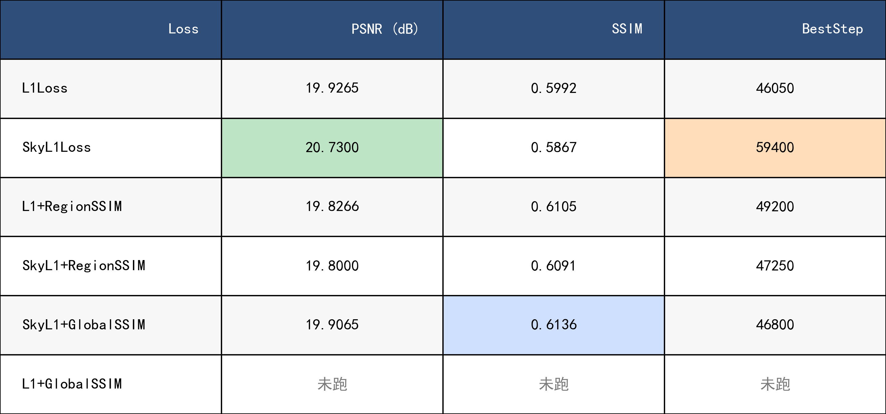

# Semantic-Dehazing

## ExperimentOne

```bash
python main.py --net='ffa' --crop --crop_size=240 --blocks=19 --gps=3 --bs=2 --lr=0.0001 --trainset='rw2ah_train' --testset='rw2ah_test' --steps=60000 --eval_step=150 (--ssim_loss --ssim_loss_type='region')
 ```


