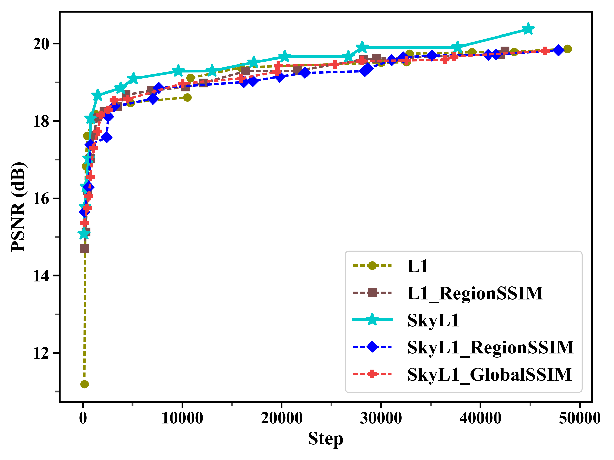
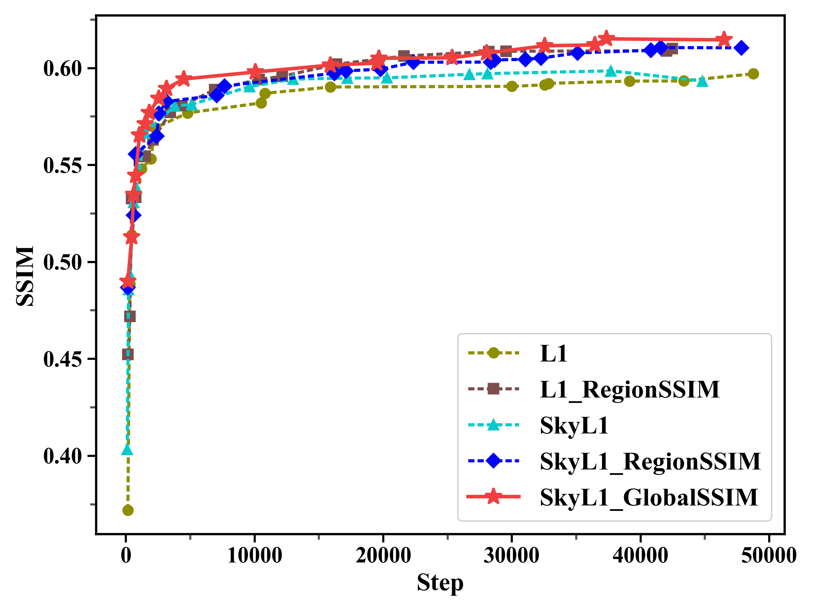

# Semantic-Dehazing

## Region-Aware-Loss

```bash
python main.py --net='ffa' --crop --crop_size=240 --blocks=19 --gps=3 --bs=2 --lr=0.0001 --trainset='rw2ah_train' --testset='rw2ah_test' --steps=60000 --eval_step=150 (--ssim_loss --ssim_loss_type='region')
 ```


 

**Algorithm: Sky-weighted L1 + Region SSIM Loss**

---

**Input:**  
- ŷ: model output image [B, C, H, W]  
- y: ground-truth clean image [B, C, H, W]  
- weight_mask: sky region weight mask [B, 1, H, W], sky 1.5,others 1.0  
- binary_mask: region mask, only buildings/trees, values {0,1} [B, 1, H, W]  
- ssim_fn: function to compute region SSIM (returns per-image values)
- coefficient: SkyL1=1.0, RegionSSIM=0.5

**Output:**  
- loss: scalar loss for backpropagation

---

**Procedure:**

1) **Per-pixel L1 (reduction='none') then mean**  
- l1_map = |ŷ - y|  // [B, C, H, W]  

1) **3x3 smoothing of weight_mask (padding to keep size)**  
- weight_mask_smooth = AvgPool2d(weight_mask, kernel_size=3, stride=1, padding=1)  // [B, 1, H, W]

1) **Sky-weighted L1 loss**  
- sky_l1_map = l1_map * weight_mask_smooth  // [B, 1, H, W]  
- sky_l1_loss = mean(sky_l1_map)  // scalar

1) **Region SSIM loss**  
- masked_ŷ = ŷ * binary_mask  
- masked_y  = y * binary_mask  
- ssim_val = ssim_fn(masked_ŷ, masked_y)  // per-image values  
- region_ssim_loss = 1.0 - mean(ssim_val)  // scalar

1) **Total loss**  
- loss = sky_l1_loss + 0.5 * region_ssim_loss

1) **Backpropagation**  
- loss.backward()

---
